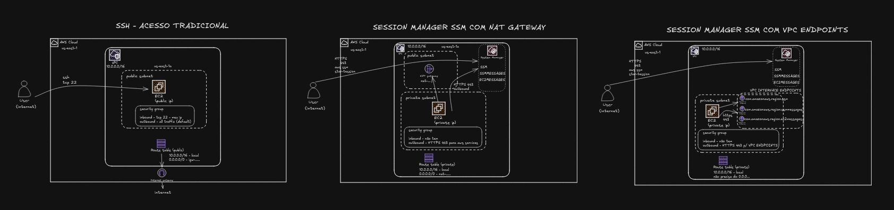

# EC2 e AWS Systems Manager Session Manager

Laboratório Terraform com três formas de acessar uma EC2: SSH pela internet, Session Manager em subnet privada e Session Manager com endpoints PrivateLink. A rede é criada e mantida pelo projeto [`aws-vpc`](../aws-vpc). Este projeto gerencia apenas os recursos das três instâncias e os endpoints PrivateLink.



## Estrutura

Todos os arquivos `.tf` ficam na raiz e compartilham um único backend, provider, conjunto de variáveis e estado. Os arquivos de cada instância começam com `ec2_ssh_`, `ec2_session_manager_nat_gateway_` ou `ec2_session_manager_private_link_`. `vpc_data.tf` consulta no Parameter Store os IDs da VPC, da subnet pública A e da subnet privada A.

| Instância | Rede | Acesso |
| --- | --- | --- |
| SSH | Subnet pública A, IP público | Chave RSA e TCP 22 restrito a `ssh_allowed_cidr` |
| Session Manager NAT | Subnet privada A, sem IP público | HTTPS para o Systems Manager |
| Session Manager PrivateLink | Subnet privada A, sem IP público | HTTPS restrito aos endpoints SSM da VPC |

O projeto `aws-vpc` deve ser aplicado primeiro, na mesma conta e região, para publicar `/vpc_id`, `/public_subnet_1a_id` e `/private_subnet_1a_id`. Os demais IDs das subnets são publicados por ele para outros consumidores.

## Aplicar

Configure credenciais AWS, o bucket de estado em `live/sandbox/backend.tfvars` e `ssh_allowed_cidr` em `live/sandbox/terraform.tfvars` com seu IP público e máscara `/32`. São necessários Terraform, AWS CLI e o plugin do Session Manager. A identidade que abre sessões precisa de permissões próprias para Session Manager.

Na raiz deste projeto:

```bash
terraform init -backend-config=live/sandbox/backend.tfvars
terraform plan -var-file=live/sandbox/terraform.tfvars -out=tfplan
terraform apply tfplan
```

Revise o plano antes do apply: ele cria três EC2, endpoints, discos e uma chave SSH. A chave privada é salva em `ec2-ssh.pem` na raiz, com permissão `0400`; seu conteúdo também fica no estado Terraform. O arquivo `.pem` e os estados locais são ignorados pelo Git.

## Consultar os outputs

```bash
terraform output vpc_id
terraform output public_subnet_1a_id
terraform output private_subnet_1a_id
terraform output -raw ec2_ssh_command
terraform output -raw ec2_session_manager_nat_gateway_command
terraform output -raw ec2_session_manager_private_link_command
```

Também estão disponíveis os IDs e IPs das três instâncias e `ec2_ssh_private_key_path`. Nenhum output revela o conteúdo da chave privada.

## Comportamento dos endpoints

Os endpoints SSM têm DNS privado; portanto, seus nomes resolvem para os endpoints em toda a VPC. A instância chamada “NAT” usa uma subnet com rota NAT e regra de saída HTTPS para a internet, mas, quando os endpoints existem, suas conexões SSM também são direcionadas ao PrivateLink. O grupo de segurança dos endpoints aceita HTTPS apenas da instância PrivateLink; assim, a instância NAT pode ficar inacessível pelo Session Manager nessa configuração. Para observar o caminho SSM pelo NAT de fato, é preciso remover ou desabilitar os endpoints de DNS privado em uma configuração separada.

A instância PrivateLink só permite saída HTTPS para o grupo de segurança dos endpoints. O SSM Agent já vem na AMI Amazon Linux 2023 e é iniciado pelo `user_data`; pode levar alguns minutos após o apply para ficar online.

## Migração de estados existentes

Se a configuração anterior da raiz já foi aplicada, seu estado ainda contém a VPC, subnets, NAT Gateways, rotas e parâmetros SSM. **Não aplique nem destrua este projeto antes de retirar esses recursos do estado antigo e confirmar que a rede está gerenciada pelo estado de `aws-vpc`.** Apagar seus arquivos `.tf` faz o Terraform planejar a destruição de recursos que ainda constem no estado. Faça backup dos estados e use `terraform state list` para comparar os endereços. Migre recursos ainda não gerenciados por `aws-vpc` para o estado desse projeto ou remova do estado antigo apenas os que já estão comprovadamente no estado de `aws-vpc`.

Os parâmetros antigos usavam nomes como `/sessionmanager/aws-vpc/vpc_id` e `/aws-vpc/vpc_id`; os nomes esperados agora ficam diretamente na raiz, como `/vpc_id`. Aplique primeiro `aws-vpc` e confirme que os novos parâmetros existem. Se as instâncias EC2 antigas ainda estiverem em estados separados, migre seus recursos para o estado unificado antes de aplicar aqui; do contrário, o plano tentará criá-las novamente. O arquivo `ec2-ssh.pem` agora é esperado na raiz.

## Remoção

```bash
terraform plan -destroy -var-file=live/sandbox/terraform.tfvars -out=tfplan.destroy
terraform apply tfplan.destroy
```

Esse comando remove apenas recursos do estado deste projeto. A rede pertence ao estado de `aws-vpc`.
